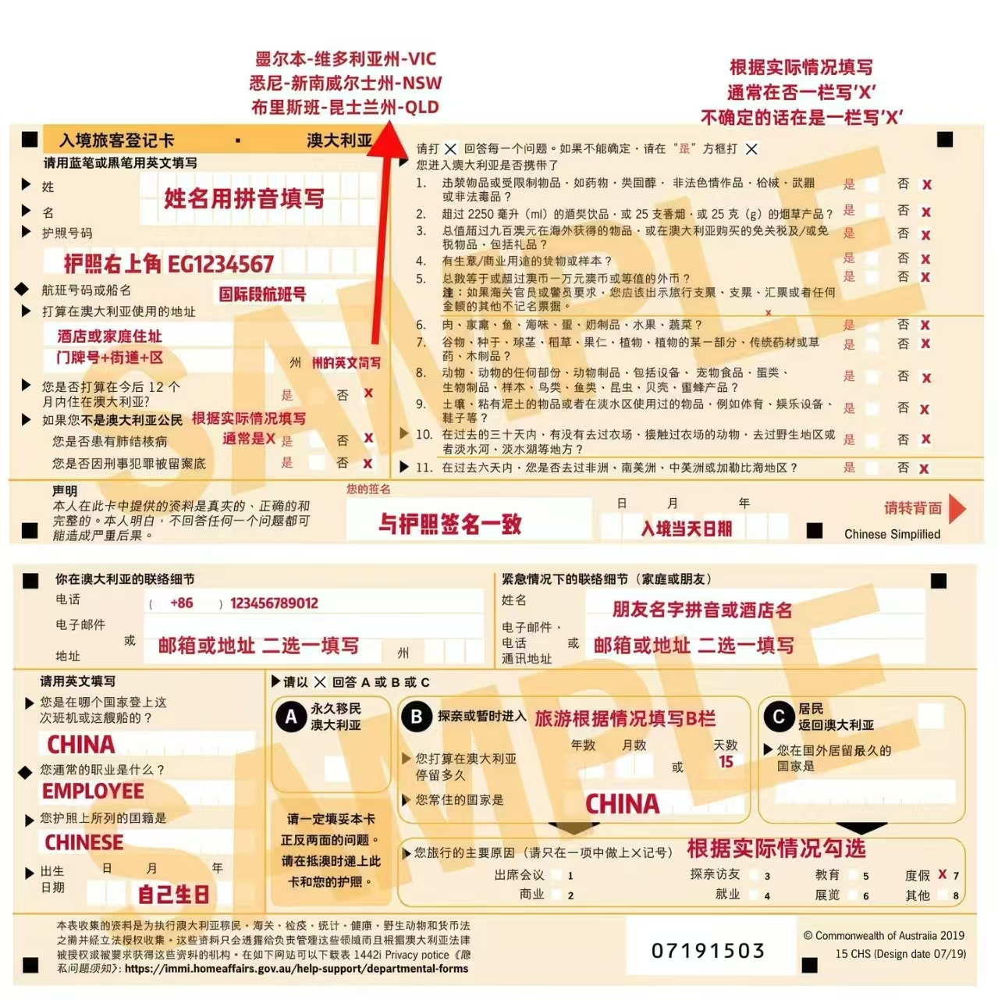
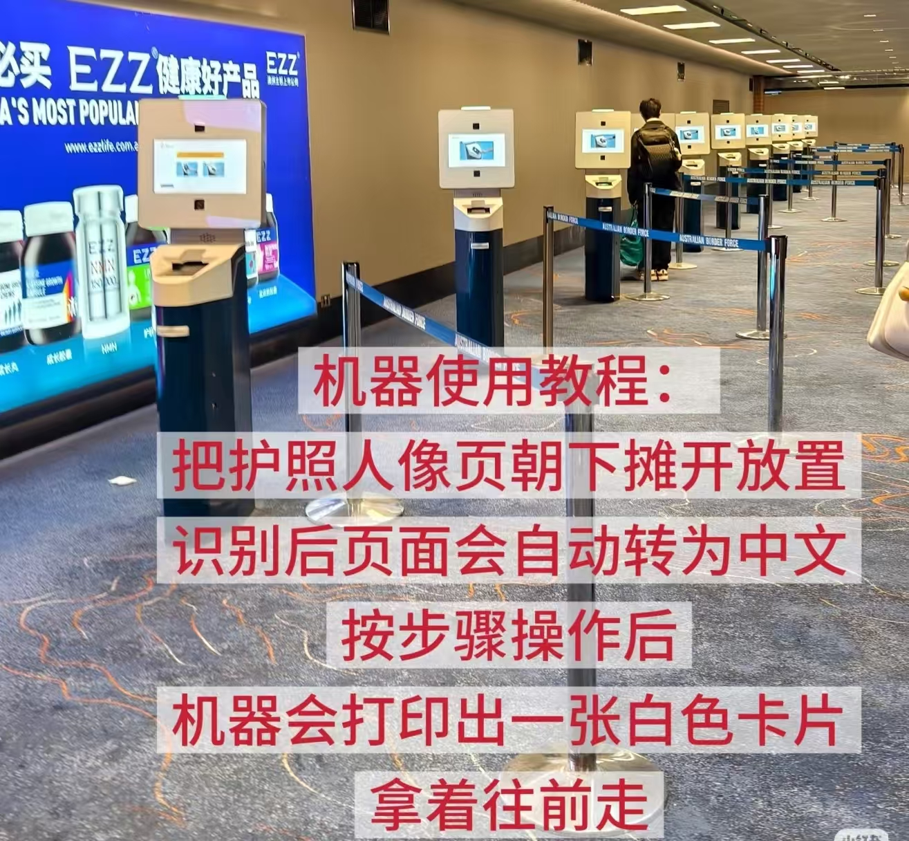
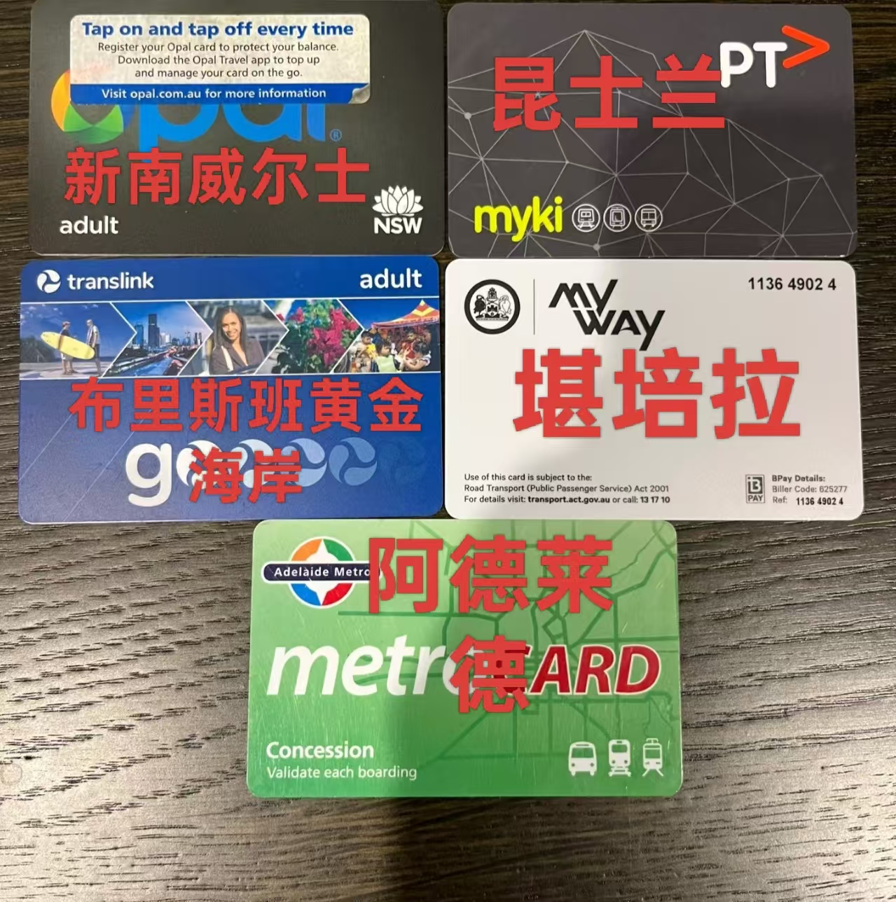
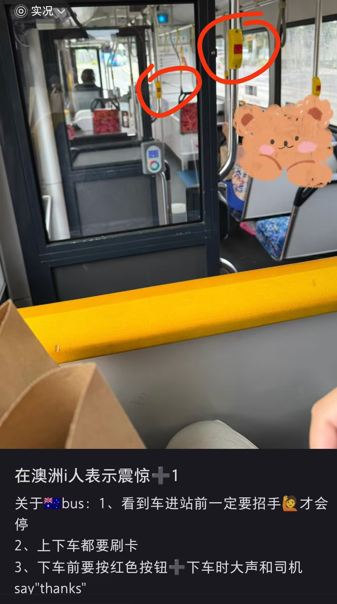
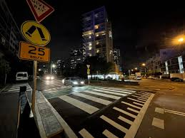
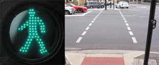
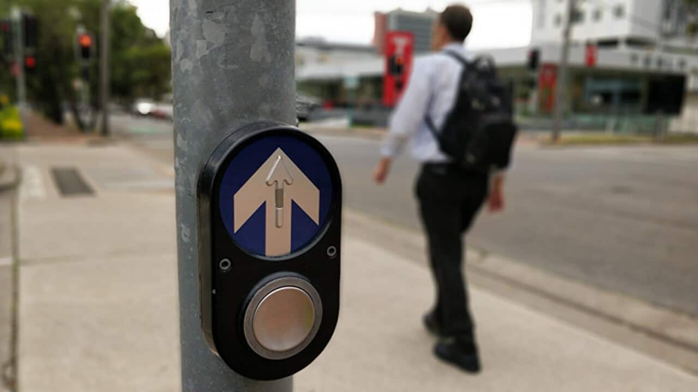

## 澳大利亚-新西兰旅行攻略

本攻略是为了没去过澳大利亚和新西兰的同志，进行一个完整的规划。

#### A 入境澳大利亚攻略

##### A.1 入境前

跨国飞机一般都比较冷，毛毯是免费的先到先得。每个飞机前方有个大平板可以看电影/打游戏，当然你可以缓存你喜欢的综艺和电视剧带上飞机。晚上大家都睡着了，如果你坐在中间可能不太好上厕所，但是如果你坐在边上可能被人打扰借过，因此自行取舍一下。如果遇到外国人体味比较大，你可以向空姐申请换座位。建议带个酒店一次性拖鞋，晚上睡觉的时候穿拖鞋很爽的。

在飞机上最后3个小时，空姐会发**入境卡**，你可以要求要一个中文版本的，在飞机上用你带的笔填一下。**不要忘记在飞机上带个黑色水笔哦！**模板如下图：

**注意：**

1. 海关看不懂中文哦，因此内容都**以拼音和阿拉伯数字为主**。
2. <u>严格按照护照上的拼音和数字填写，保持一致</u>，别自找麻烦。
3. 按道理来讲，处方药（即无OTC字样的药）需要申报；但是如果你有但是量不大，建议不用申报了，全部打叉就行。
4. 千万不要带任何熟肉，鱼干，蛋奶，蜂蜜或者任何鲜活的植物动物和你一起，这不是诺亚方舟！！！
5. 别打对勾，有没有都全部打叉“x”！

_图 1. 入境卡_

##### A.2  入境时

国外机场很小，只有一条路无岔口，跟团的话跟紧点别走散了。从廊桥进机场后有免费的 WiFi ，走几步到机场核心信号就强了，可以白嫖使用。机场所有指示牌都有中文，甭担心。机场机场入境后，要先找到入境“通关机”，如图。

_图 2. 自助机器_

把护照人像页朝下摊开放置机器吐出来一个白色卡片，拿着卡片到前方闸口刷脸通。随后领取托运的行李。最后一关是入境申报，就像地铁安检一样，会有人工回收入境卡并问你问题。入境卡上有“是”项就走红色区域，都是“否”就走绿色区域。在过关时，如果听不懂工作人员的指示，就用英语告诉他们需要翻译：“I need a **Mandarin interpreter,** please”。好在如果入境卡都是“否”且行李箱里无任何奇怪东西的话，一般就放你走了（如果没人搭理你直接走就行，别犹豫）。

##### A.3 入境后

收好个人物品，尤其是护照不能丢，按照季节在机场内容厕所换好衣服，别冻感冒了！澳大利亚是海洋性气候，**昼夜温差极大**，别相信和风煦日的白天，尽量带一件外套在身上防风！

----

#### B 公共交通攻略

**支付方式**：

1. 悉尼：Opal 或 Visa/Master 银行卡皆可。
2. 墨尔本：myki 为主，基本不能刷银行卡，CBD 市中心有 Free Tram Zone，即免费乘车。
3. 布里斯班/黄金海岸：go card 为主，银行卡支付逐步覆盖，出发前查当地规则。
4. 新西兰奥克兰：AT HOP 为主，能刷银行卡。
5. 新西兰惠灵顿：Snapper 常见，能刷银行卡。

_图 3. 澳每个州的公交/地铁 一卡通（新西兰懒得找了）_

**澳洲+新西兰 人少，公交规矩多**：

1. 在站台时，来了要上的公交车，必须向司机招手才停
2. 下车前要提前按下按钮司机才停。一般情况澳大利亚公交车没有报站功能，提前手机导航，快到站了提前按下按键（红色圈圈的地方），以免坐过车去奇怪的地方。
3. **上车刷+下车刷**：公交车和 地铁/轻轨/火车 都一定上下车都刷一次。第一次是开始计费，第二次是结束计费，根据你的两次间隔的路程动态收费；**只刷一次要付全程的车费哦！！**
4. 公交的刷卡桩在车内前后门，轻轨和火车的刷卡桩在上/下车点的站台中间。

_图 4. 公交规则怪谈_

**步行过街的左行交通**：过马路先看右侧，人行道

1. 人行斑马线若存在，不用管车直接走，你享有最高路权，车必须让你。

   

_图 5. 斑马线直接走_

2. 如果人行道过街是这种虚线，必须等绿灯才能通过，需要**点下过街按钮**，绿灯才有可能出现。。

_图 6. 需要等灯及其按钮_

----

#### C 景点景区安全攻略

这里我希望分成两个景点：

##### C.1 自然景观 - 人迹罕至

澳大利亚、新西兰多地常住人口稀疏，十二门徒岩、大堡礁绿岛、蓝山国家公园及三姐妹峰等知名自然景点原生开发程度极低，出行需高度警惕安全风险。

该类景区普遍不设门票/安保管控，缺少护栏、指示牌、水泥柏油道路等舒服的基础设施，无小卖部、庙宇等便民配套。区域礁石、崖壁地势险峻，失足坠落极易酿成伤亡；腹地路况崎岖复杂，在自然景区手机通讯完全中断，无法上网或者拨打应急电话、发送通讯消息，一旦掉队走失迷路，救援难度极大。

**安全要求：**

1. 全程紧跟出行队伍，行进时留意脚下路况；
2. 自带足饮水和干粮，切莫贪图拍照掉队；
3. 出游务必穿着合脚防滑运动鞋、长裤、雨伞，严禁靠紧、招惹野生袋鼠袋熊；
4. 提前下载离线地图，带充电宝；
5. 严禁靠近临海陡坡、高危礁石边缘，不跨越护栏，不走封闭步道；
6. 海边礁石注意突然大浪；
7. 新西兰徒步天气变化快，自由活动时，如果选择长线徒步要告诉别人路线（建议别）；

​	**这种未开发的景区风景美得很，和国内体验完全不一样，风景值得看，但不要为了拍照冒险。。**

**C.2 人文景观 **

比如悉尼大学、悉尼歌剧院、墨尔本国会大厦、霍西尔巷、新西兰市政公园、唐人街等地区人比较多，安全性和道路。但是一定要当心骗子，有很多诈骗犯、满清遗老，法轮功邪教，东南亚园区蛇头出没，专挑年轻中国人下手。因此不要脱离导游视线，不要和陌生人亚洲人、白人 teens 搭话（普通白人还挺好的，只是好奇）。

##### C.3 自由活动路线

新西兰的皇后镇可以去镇中心、Skyline Gondola，晚上人巨少，尽量不走偏僻湖边小路。悉尼的自由活动我推荐打车点对点到悉尼歌剧院（Circular Quay/Opera House），那边晚上人多安全，灯光秀丽，拍照出片，形如上海外滩。或者Chinatown + Haymarket 这两个地铁站的范围内是市中心步行街，也有唐人街和沿街商铺，热闹安全。墨尔本我推荐南十字街及其周边（Southern Cross、Flinders Street、Federation Square、State Library、NGV、Southbank、Royal Botanic Gardens）等。

**天黑后远离流浪汉和醉鬼。** **下午四点左右远离放学的 teens。**

最后，风景诚可贵，安全价更高，请务必猥琐发育，别浪！

----

#### D 紧急情况联系方式

##### 紧急求助电话

澳洲紧急电话：000
新西兰紧急电话：111
（全澳/新警察、急救、消防共用）
英文不好听不懂时说：I need a Mandarin interpreter, please.”。
拨通后接线员通常会询问你需要警察、消防队还是救护车。请尽量提供详细的位置信息，如城区、街道名称和门牌号。如果你在公路上，请告知最近经过的城镇和公路名称。在接线员获得所有必要信息前，请不要挂断电话。

##### ✅非紧急报警电话

澳洲非紧急报警：131 444
新西兰非紧急报警：105

适用于车辆被盗、盗窃、交通小事故、财物丢失或邻里纠纷等非紧急情况。

##### ✅免费翻译服务电话

澳洲翻译服务 TIS National：131 450
当你需要与政府部门、医院或学校沟通时使用。尽管等待时间可能较长，建议你早上拨打此电话。接通后，你可以直接请求Mandarin/Cantonese翻译服务。

##### ✅澳洲大使馆和领事馆电话

中国外交部全球领事保护热线：+86-10-12308 或 +86-10-65612308。
具体使领馆电话按所在城市建议提前查询：中国驻澳大利亚/新西兰使领馆官网或“中国领事”App。

----

#### E 日常商店及其类型

澳洲和新西兰购物逻辑很像，但品牌不完全一样。按需求分清楚，比盲逛省很多时间：
买吃的去综合超市；买平价衣物家居去 Kmart / The Warehouse；买保健品去药房；想一站式逛街去购物中心；买数码家电去专业店。

##### 一、综合超市

市中心部分门店营业到很晚（20：00点），郊区门店通常关得早一些。适合买：零食、生鲜、饮料、早餐食材、日用品、本土伴手礼；自助结账很常见，水果蔬菜需要自己按品类称重或扫码。

**澳新常见超市**

**Woolworths**
华人常叫“绿超”，澳洲头部连锁。生鲜、肉蛋奶、蔬果、零食、日化都很全，门店覆盖率高。

**Coles**
华人常叫“红超”，和 Woolworths 功能高度重合。经常有半价促销，零食、速冻食品、日化用品很适合蹲折扣。

**ALDI**
德系平价超市，自有品牌多，价格通常比红绿超低一些。适合囤基础食材、牛奶、面包、零食和日用品。品类没有红绿超那么全，购物袋一般需要自带或另买。

**IGA**
社区型小超市，常见于郊区、小镇、景区附近。价格通常略高，但胜在方便，偏远地区很实用。

##### 亚超

能买到你熟悉的一切。

- 华人/亚洲超市适合买泡面、火锅底料、老干妈、酱油、亚洲零食、米面调料；
- 价格通常比国内贵，也可能比本地超市贵；
- 适合“中国胃救急”，不适合大量囤普通日用品；
- 可在 Maps 搜： Asian grocery、Chinese supermarket、Korean mart、。

**新西兰特有**

**New World**
偏中高端，生鲜、熟食、烘焙品质不错，价格通常比 Pak’nSave 高。

**Pak’nSave**
黄色标识，仓储式超市，新西兰性价比很高，适合大批量买食材、零食和日用品。

**Four Square**
社区便利型小超市，小镇、偏远地区、景区周边常见，适合临时补给。

**采购建议：**
日常吃喝、早餐、零食、泡面、牛奶、水果、本土零食伴手礼，优先去这一类。

**注意：澳新普通超市通常不直接卖酒，要去 BWS、Liquorland、Dan Murphy’s 等酒类店，买时需检查护照；**

##### 二、平价服饰和家居百货

适合买：换洗衣物、床品、厨具、收纳、平价小家电、旅行临时用品

**澳洲**

**Kmart**
澳洲平价百货代表，性价比很高。衣服、鞋袜、床品、锅具、餐具、收纳、小家具、小电器、户外用品基本都有。非常适合刚落地、搬家、旅行临时补东西。

**Target**
定位略高于 Kmart，服饰和家居质感会更精致一些，但门店覆盖不如 Kmart，需要提前查附近是否有店。

**Big W**
Woolworths Group 旗下平价百货，定位接近 Kmart。童装、基础服饰、玩具、家居日用品都比较实用。

**新西兰**

**Kmart**
新西兰也有 Kmart，适合买平价衣物、床品、厨具和收纳用品。

**The Warehouse**
新西兰本土平价百货，红色标识，覆盖率高。可以买衣服、家居、文具、小电器、玩具和旅行临时用品。

##### 三、药房、保健品和美妆

适合买：保健品、护肤品、常备药、防晒、驱蚊、洗护用品

**Chemist Warehouse**
澳洲和新西兰都有，常简称 CW。保健品、开架护肤、洗护、防晒、常备非处方药都很全，价格经常有优势。游客买鱼油、钙片、维生素、蜂胶、护肤品等不占空间的伴手礼，可以优先看这里。

**Priceline Pharmacy**
主要在澳洲常见，美妆和护肤品牌更丰富，活动也多。想买彩妆、护肤、药妆类产品可以逛。

**Life Pharmacy / Unichem**
新西兰常见药房，适合买药品、护肤、美妆、保健品。部分门店也能处理处方药需求。

**采购建议：**
买保健品伴手礼、常备药、防晒、驱蚊、护肤品，优先去药房；价格可以对比 CW 和其他药房活动。

##### 四、大型购物中心

适合：一站式逛街、吃饭、买衣服、买礼品、看电影。商场通常 17:00-18:00 左右就陆续关门

**澳洲**

**Westfield**
澳洲常见大型购物中心品牌，里面通常集合超市、药房、服饰、餐饮、影院、数码店和各类品牌专卖店。想集中逛街，直接搜附近 Westfield 很方便。

**Myer**
澳洲本土百货，常见于大型商场，主营服饰、美妆、家居、礼品，定位比 Kmart / Big W 高。

**David Jones**
澳洲高端百货，定位通常高于 Myer，适合买轻奢、美妆、设计师品牌和精致礼品。

##### 新西兰

新西兰也有一些大型商场，比如 Westfield Newmarket、Westfield Riccarton、Sylvia Park 等。
百货类可以重点看 **Farmers**，它是新西兰常见的本土百货，适合买服饰、家居、美妆和礼品。

**营业时间参考：**
购物中心通常 9:00 或 10:00 开门，17:00-18:00 左右关门；部分商场周四或周五会延长到 21:00 左右。不同城市和门店差异很大，出发前一定看 Google Maps。

**五、数码和家电专卖店**

适合买：耳机、相机、电脑、游戏机、电视、厨房电器、办公用品

**JB Hi-Fi**
澳新都常见的数码连锁。耳机、音响、游戏机、相机、电脑、手机配件、影音设备都比较全，经常有折扣。买数码类伴手礼可以先看这里。

**Harvey Norman**
澳新都有，主营家电、家具、电脑、床垫和影音设备。适合买大家电和居家电器。

----

#### F 杂项避坑

1. **出发前证件**：护照有效期、签证、机票、酒店订单、旅行保险。

2. **澳洲退税**：购买的纪念品单笔消费满 300 澳元（同一家店）、保留小票 + 商品、退税比例（约 10%、各州不同）、机场退税流程提前查好（需要提前 1.5 小时到机场排长队）。

3. **防晒**：**澳新臭氧层破了，紫外线很强**！！！防晒霜、墨镜、帽子比想象中重要。

4. **插头**：澳新都是 Type I 八字插头，国内两脚插头不一定稳，建议带转换头。

5. **野生制品：**不要买袋鼠蛋蛋等生物制品当纪念品，中国海关会没收。

6. **公共假期**：公共假期商店、餐厅可能缩短营业或加收 surcharge，大约10% - 20%。

7. **酒店：**酒店无一次性洗漱用品 / 拖鞋（需自备），毛巾也尽量用自己的。

8. 不要被意林骗了，澳新的水龙头里的水绝对不能直饮，重金属超标。烧开水再喝。

9. **小费**：澳新没有强制小费文化，餐厅账单一般不需要额外给小费；服务特别好想给也可以，但不是义务。

10. 白人给你打招呼一般是” how is it going？“ 回复” good good“就行。

    

